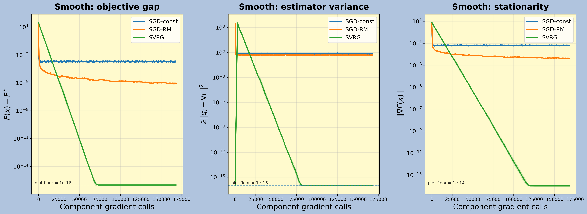

# Stochastic Approximation and Variance-Reduced Proximal Gradient Methods

[](https://github.com/KM016/SGD-UOB-individual-project/actions/workflows/ci.yml)

An investigation of the mechanism separating classical stochastic-gradient methods from variance-reduced methods: whether gradient-estimator noise persists or vanishes near the optimum.

**University of Bristol · Level 6 Mathematics Project · Keyaan Miah · 92%**

The submitted dissertation is available as [MiahK Individual Report.pdf](./MiahK%20Individual%20Report.pdf). The exact repository state first published with the dissertation is preserved under the [`original-submission`](https://github.com/KM016/SGD-UOB-individual-project/tree/original-submission) tag. The report and its conclusions are unchanged; subsequent work makes the accompanying experiments reproducible and tested.



## Research question

Classical SGD is an instance of Robbins-Monro stochastic approximation. With a constant step size, non-zero gradient noise at the optimum produces an error floor; a Robbins-Monro schedule suppresses that noise but introduces a slow tail. SVRG-style control variates instead make estimator variance vanish as the iterate and snapshot approach the optimum.

The project studies that distinction for smooth and L1-regularised finite-sum least-squares objectives, using SGD, proximal SGD, SVRG and proximal SVRG under matched component-gradient budgets.

## Experimental evidence

The report uses synthetic problems with `n=2,000`, `d=50`, five independent seeds and two conditioning regimes. Objective gap, distance to the reference optimum, stationarity and estimator variance are logged against component-gradient calls.

| Setting | Method | Final objective gap, mean ± std | Estimator variance at end, mean ± std |
|---|---|---:|---:|
| Well-conditioned smooth | SGD, constant step | 1.98e-3 ± 1.2e-5 | 7.45e-1 ± 5.0e-2 |
| Well-conditioned smooth | SVRG | ≤1e-16 plotting floor | ≤1e-16 plotting floor |
| Well-conditioned composite | Prox-SGD, constant step | 6.06e-3 ± 1.4e-4 | 1.98e0 ± 5.4e-1 |
| Well-conditioned composite | Prox-SVRG | ≤1e-16 plotting floor | ≤1e-16 plotting floor |
| Ill-conditioned smooth | SVRG | 6.55e-6 ± 2.5e-7 | 8.29e-9 ± 7.8e-10 |
| Ill-conditioned composite | Prox-SVRG | 5.46e-7 ± 4.2e-8 | 1.77e-9 ± 3.2e-10 |

These are the values reported in Tables 4.2 and 4.3 of the dissertation. The plotting floor is a numerical visualisation threshold, not a claim of exact arithmetic convergence. Ill-conditioning slows contraction substantially; it does not change the observed vanishing-noise mechanism.

## Repository structure

```text
.
├── .github/workflows/ci.yml       # static, numerical and smoke checks
├── figures/                       # selected report figures
│   ├── ill-conditioned/
│   └── well-conditioned/
├── notebooks/
│   └── experiment_final.ipynb     # original exploratory notebook
├── scripts/
│   ├── experiment.py              # well-conditioned experiment
│   ├── ill_conditioned_experiment.py
│   ├── prox_step_visualization.py
│   └── variance_reduction_trajectory.py
├── tests/test_numerics.py         # mathematical and reproducibility checks
├── Makefile
├── MiahK Individual Report.pdf
└── pyproject.toml
```

The scripts are the canonical reproduction path. The notebook is retained as part of the original project record.

## Quickstart

Python 3.11 and 3.12 are supported.

```bash
git clone https://github.com/KM016/SGD-UOB-individual-project.git
cd SGD-UOB-individual-project

python3 -m venv .venv
source .venv/bin/activate
python -m pip install --upgrade pip
python -m pip install -e ".[dev]"

make test
make smoke
```

`make smoke` runs bounded versions of both experiments and writes their outputs under `.artifacts/smoke/`. Smoke results validate the execution path; they are not the results quoted in the dissertation.

## Reproducing the reported experiment configuration

```bash
make reproduce
```

This runs the complete well-conditioned and ill-conditioned configurations, regenerates the mechanism plots, and writes detailed JSON logs and summary statistics. The full ill-conditioned experiment is intentionally computationally substantial.

The default output locations are:

- `figures/well-conditioned/`
- `figures/ill-conditioned/`
- `logs/well-conditioned/`
- `logs/ill-conditioned/`
- `statistics/`

Both main scripts also accept `--output-root PATH`, allowing validation without overwriting the selected report figures:

```bash
python scripts/experiment.py --quick --output-root /tmp/sa-well
python scripts/ill_conditioned_experiment.py --quick --output-root /tmp/sa-ill
```

## Validation

The automated checks cover:

- deterministic synthetic-data generation;
- agreement between analytic gradients and finite differences;
- stationarity of the closed-form ridge solution;
- the proximal reference solver and gradient mapping;
- zero SVRG estimator variance when the iterate equals its snapshot;
- seeded algorithm reproducibility and objective-gap reduction;
- construction of the intended ill-conditioned problem;
- creation of missing output directories on a clean clone.

GitHub Actions runs these checks plus bounded end-to-end experiments on every push and pull request.

## Scope and limitations

- The experiments use controlled synthetic quadratic objectives rather than a real-world learning task.
- Strong convexity and finite-sum structure are central to the reported linear-convergence mechanism.
- Rate fits and final-stage summaries depend on the stated budgets, fitting windows and plotting floors.
- The high-accuracy composite optimum is produced numerically with ISTA rather than analytically.
- The experiments illustrate and test the dissertation's theory; they are not a general benchmark of every SGD or variance-reduction implementation.

## Selected references

- Robbins, H. and Monro, S. (1951). *A Stochastic Approximation Method*.
- Johnson, R. and Zhang, T. (2013). *Accelerating Stochastic Gradient Descent using Predictive Variance Reduction*.
- Xiao, L. and Zhang, T. (2014). *A Proximal Stochastic Gradient Method with Progressive Variance Reduction*.
- Bottou, L., Curtis, F. E. and Nocedal, J. (2018). *Optimization Methods for Large-Scale Machine Learning*.
- Garrigos, G. and Gower, R. M. (2023). *Handbook of Convergence Theorems for (Stochastic) Gradient Methods*.

The complete bibliography and theoretical development are contained in the dissertation.
